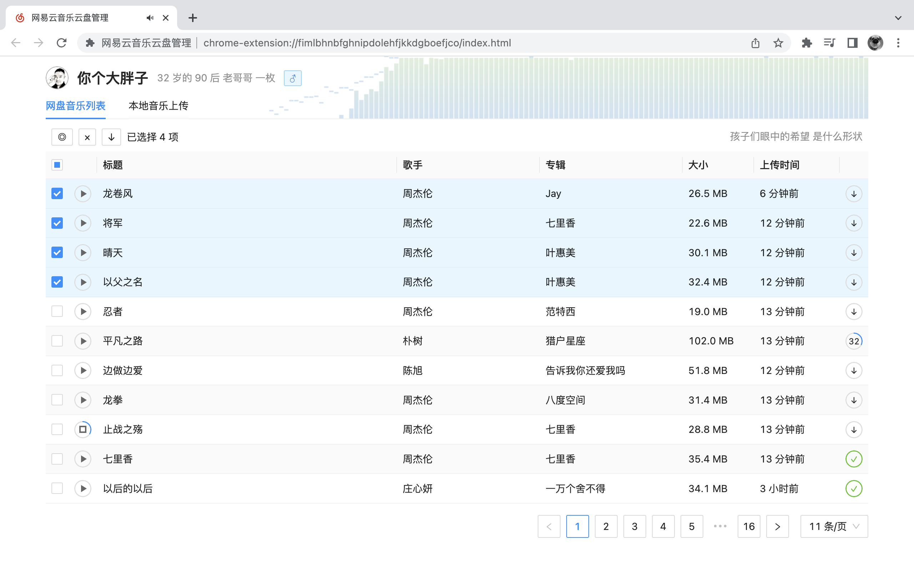
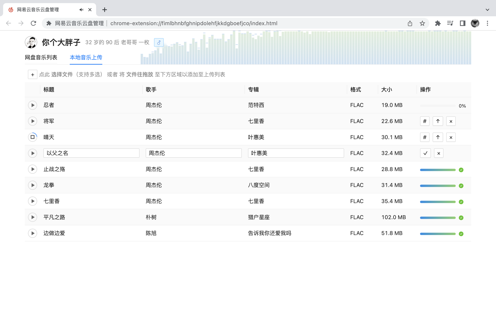

## 网易云音乐云盘上传管理 Chrome 插件

> 插件仅需要 https://\*.music.163.com/\* 的权限以便能直接使用该域名下自带的Cookie“跨域”访问网易云音乐的接口，除此之外不会再索要你其它任何权限，请放心食用

本项目中所有网易云音乐的接口均参考自 [NeteaseCloudMusicApi](https://github.com/Binaryify/NeteaseCloudMusicApi) 项目，在此表示感谢

#### 插件安装

- 应用商店安装：[Google Chrome](https://chrome.google.com/webstore/detail/%E7%BD%91%E6%98%93%E4%BA%91%E9%9F%B3%E4%B9%90%E4%BA%91%E7%9B%98%E7%AE%A1%E7%90%86/gnfemfddeadngnfhcpbdhlgbbnokokcg)｜[Microsoft Edge](https://microsoftedge.microsoft.com/addons/detail/%E7%BD%91%E6%98%93%E4%BA%91%E9%9F%B3%E4%B9%90%E4%BA%91%E7%9B%98%E7%AE%A1%E7%90%86/ejngoibgpebbaodiaccaifkipoppaaff) 
- 源码本地自己编译：
  > 1. 下载源码
  > 2. 本地安装 Node.js 16+ （推荐 18 LTS）
  > 3. 安装依赖：`yarn` 或者 `npm i`
  > 4. 打包：`yarn build` 或者 `npm run build`
  > 5. 最后 打包的 dist 目录则是插件的根目录，打开 Chrome 扩展程序页面 `chrome://extensions/`
  > 6. 启用开发者模式 - 加载已解压的扩展程序  

#### 插件截图

#### LICENSE

[WTFPLv2](LICENSE)